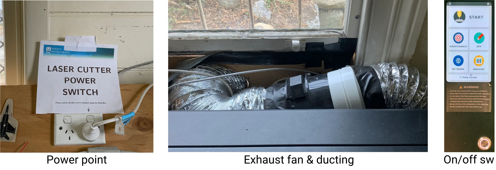
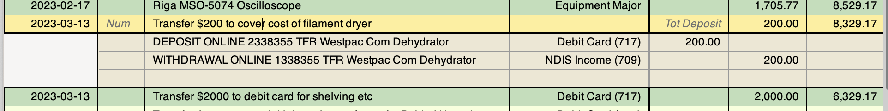

For full details, go to [Laser Cutter Basics](Laser%20Cutter%20Basics), but briefly:
and downloadable from [the manufacturer's website](https://studio.flux3dp.com). 
- Be aware of [basic laser cutter safety](Laser Cutter Safety).
- For this turorial, we provide [an example workfile](https://hobarthackerspace.org.au/assets/wiki-assets/lasercutter_example.svg) for you to try.
{width="500px"}
The plugins are used to extend the functionality of the wiki. Most of them are accessible through the use of `tags`.
For now there are only a few supported.  

- `[[draw]]` Allows you to add an **interactive drawio drawing** to the wiki.  
- `[[info]]`, `[[warning]]`, `[[danger]]`, `[success](success)` Adds a nice **alert message**.
GnuCash has many settings; [these are documented below](#appendix) as screen captures.
Recent copies of the Chart of Accounts are [here](https://hobarthackerspace.sharepoint.com/:f:/s/Committee/EjbcgA2yy6FGiVCe_1RasLIBxKAvigifYcO07rbHI1c5MA?e=pofcOY).
A [transaction split](#transactions) showing funds moving *to* or *from* a real account 

